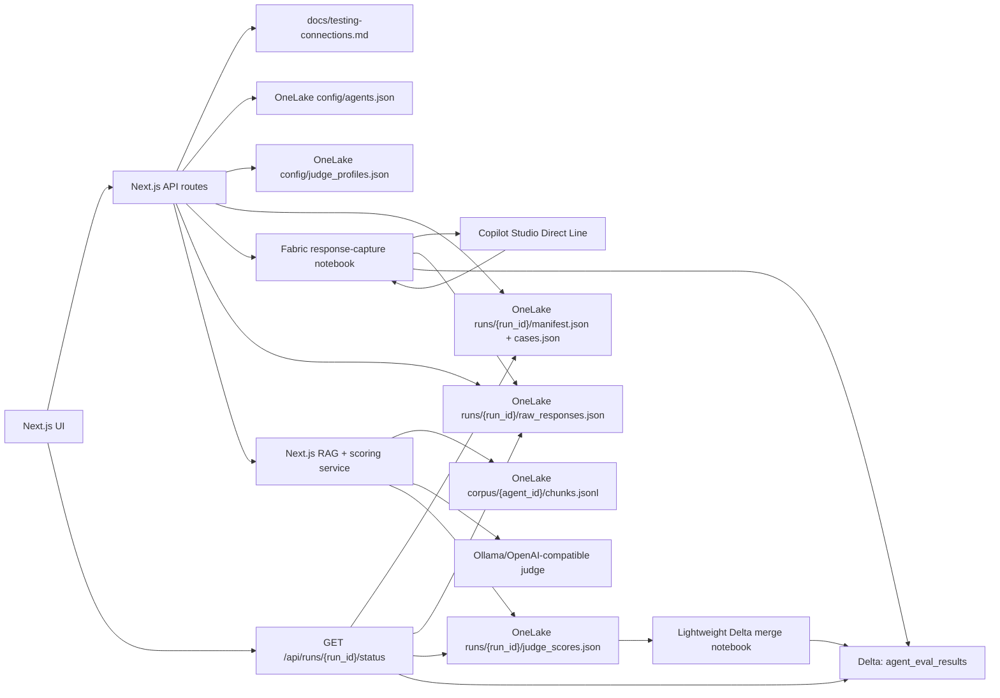

# Next.js Copilot Agent Evaluation App - Staged Implementation Plan

## Summary

Build a standalone Next.js/React web app for end-to-end testing of Copilot Studio agents. The app runs outside Fabric. Fabric Lakehouse/OneLake is used for configuration storage, run artifacts, response captures, judge score files, and the final Delta result table.

The app evaluates uploaded CSV questions against Copilot Studio agent answers. The CSV does not need expected answers. The app retrieves source-of-truth context, asks a configurable judge LLM to create a reference answer and scores, then writes the final result into a single wide Delta table.

For the testing phase, connection values are allowed to be hardcoded into a committed documentation file and mirrored in a server-only config module. This must be treated as temporary; secrets should be rotated before production.

## Architecture



## Stage 0 - Repository And Testing Connection Baseline

Goal: make the repo ready for app implementation and document the temporary testing connections.

Deliverables:

- Create `docs/testing-connections.md` with the testing connection inventory:
  - Fabric workspace ID/name.
  - Lakehouse ID/name.
  - OneLake roots for `Files/agent_eval`, config, runs, and corpus.
  - SQL analytics endpoint connection string for read-only result queries.
  - Fabric response-capture notebook ID/name.
  - Fabric merge notebook ID/name.
  - Copilot agent ID/display name/schema/environment/bot IDs.
  - Direct Line secret for testing.
  - Ollama/OpenAI-compatible judge base URL, model, timeout, temperature.
  - Local dev commands and required ports.
- Add a warning in the doc that committed testing secrets must be rotated before production.
- Add `src/lib/testingConnections.ts` during implementation with the same values in a typed, server-only object.
- Keep every consumer of connection values routed through the server-only config module so migration to environment variables or Key Vault is localized later.

Acceptance criteria:

- A developer can open the repo and identify every external dependency needed for the test environment.
- No browser-facing file imports `testingConnections.ts`.

## Stage 1 - Next.js App Scaffold

Goal: create the standalone web app shell.

Deliverables:

- Scaffold a Next.js TypeScript app in the repo root.
- Use App Router, route handlers, Tailwind, ESLint, and shared TypeScript types.
- Add primary routes:
  - `/` dashboard.
  - `/agents` agent registry.
  - `/judge` judge and RAGAS scoring settings.
  - `/corpus` source-of-truth corpus management.
  - `/runs/new` CSV upload and run creation.
  - `/runs/[run_id]` URL-addressable run status and results.
- Add app-wide layout/navigation optimized for operational use rather than a marketing page.

Acceptance criteria:

- `npm run dev` starts the app.
- `npm run lint` passes.
- Empty UI routes render without requiring Fabric connectivity.

## Stage 2 - Shared Schemas And Data Contracts

Goal: define stable contracts before building APIs.

Deliverables:

- Add schema modules:
  - `src/lib/schemas/agent.ts`
  - `src/lib/schemas/case.ts`
  - `src/lib/schemas/judge.ts`
  - `src/lib/schemas/run.ts`
  - `src/lib/schemas/result.ts`
- CSV required columns:
  - `test_id`
  - `agent_id`
  - `suite`
  - `frequency`
  - `severity`
  - `question`
- CSV optional columns:
  - `category`
  - `source_filter`
  - `must_contain`
  - `must_not_contain`
  - `test_origin`
- Define `source_filter` as an optional text value that restricts retrieval to chunks where `tags`, `document_id`, or `title` match the filter string.
- Define uniqueness as `run_id + agent_id + test_id`.
- Keep `csv_case_index` only for import order/display, not as a key.

Acceptance criteria:

- CSV validation catches missing required fields.
- CSV validation catches duplicate `agent_id + test_id` combinations in a run.
- CSV validation catches unknown agents.
- Test cases do not require expected answers.

## Stage 3 - Fabric And OneLake Infrastructure Layer

Goal: centralize all Fabric and OneLake access behind server-side helpers.

Deliverables:

- `src/lib/fabric/auth.ts`
  - Service-principal token helper.
  - Fabric REST token helper.
  - OneLake/ADLS token helper.
- `src/lib/fabric/onelake.ts`
  - Read/write JSON.
  - Read/write JSONL.
  - Read/write CSV.
  - ETag/version-aware writes for config files.
  - Safe path builder for `Files/agent_eval`.
- `src/lib/fabric/jobs.ts`
  - Trigger Fabric notebook job.
  - Read Fabric job status.
  - Store returned job IDs in run manifests/results.
- `src/lib/fabric/results.ts`
  - Read `agent_eval_results` from the Lakehouse SQL analytics endpoint.
  - Treat SQL endpoint as read-only.

Acceptance criteria:

- Connectivity endpoint can check Fabric API, OneLake read/write, SQL read, Direct Line, and judge server independently.
- Failed connectivity checks return actionable error messages.

## Stage 4 - Agent Registry And Judge Configuration

Goal: make agent and judge configuration editable from the UI.

Deliverables:

- Agent registry backed by `Files/agent_eval/config/agents.json`.
- Use ETag/version checks so simultaneous edits do not silently overwrite each other.
- Agent fields:
  - `agent_id`
  - `display_name`
  - `enabled`
  - `platform`
  - `connection_mode`
  - `business_area`
  - `owner`
  - `schema_name`
  - `environment_id`
  - `bot_id`
  - Direct Line secret reference or testing secret value source.
- Judge settings backed by `Files/agent_eval/config/judge_profiles.json`.
- Judge fields:
  - Provider: `ollama_openai_compatible`, `custom_openai_compatible`, future `azure_openai`.
  - Base URL.
  - Model.
  - API key reference.
  - Temperature.
  - Timeout.
  - Max tokens.
  - Concurrency limit, default `3`.
  - Prompt version.
- RAGAS/scoring settings backed by `Files/agent_eval/config/scoring_profiles.json`.
- Scoring fields:
  - Relevancy threshold.
  - Grounding threshold.
  - Similarity threshold, disabled until embeddings are configured.
  - Prompt template.

Acceptance criteria:

- Agent add/edit/enable/disable works.
- Judge connection test works without creating a run.
- Config saves reject stale versions instead of overwriting.

## Stage 5 - Source-Of-Truth Corpus Management

Goal: support source-grounded scoring without expected answers in the CSV.

V1 retrieval decision:

- Source corpus lives in OneLake under `Files/agent_eval/corpus/{agent_id}/chunks.jsonl`.
- Supported inputs: `.txt`, `.md`, `.csv`, and pasted text.
- PDFs are out of scope for V1 unless added separately.
- Retrieval method is BM25/keyword search in the Next.js server over `chunks.jsonl`.
- Semantic retrieval is a future upgrade requiring embeddings and a vector index.

Chunk shape:

```json
{
  "chunk_id": "sparky-doc-001-0001",
  "agent_id": "sparky",
  "document_id": "doc-001",
  "title": "Product support notes",
  "tags": ["products", "support"],
  "text": "Chunk text...",
  "source_uri": "onelake://...",
  "updated_at": "2026-05-28T00:00:00.000Z"
}
```

Acceptance criteria:

- Users can upload/paste source material for an agent.
- App chunks and writes `chunks.jsonl`.
- Retrieval preview shows top matching chunks for a question and optional `source_filter`.
- Calibration mini-run uses the real retrieval path, not just a raw judge prompt.

## Stage 6 - CSV Upload And Run Creation

Goal: create URL-addressable runs from validated CSVs.

Deliverables:

- CSV upload UI at `/runs/new`.
- Validation preview with row-level errors.
- `POST /api/runs`:
  - Creates a `run_id`.
  - Normalizes cases.
  - Writes `runs/{run_id}/manifest.json`.
  - Writes `runs/{run_id}/cases.json`.
  - Writes agent snapshot.
  - Writes judge/scoring snapshot.
  - Triggers the Fabric response-capture notebook.
- `/runs/[run_id]` reconstructs state from OneLake and Delta after refresh or tab close.
- Client polls `GET /api/runs/{run_id}/status` every 5 seconds.
- UI sets expectations that Fabric cold starts can make runs take 5-10 minutes.

Acceptance criteria:

- User can start a run from a question-only CSV.
- Closing and reopening `/runs/[run_id]` recovers state.
- No route handler holds a 30-minute polling loop.

## Stage 7 - Fabric Response Capture Notebook Contract

Goal: capture Copilot Studio responses and insert initial Delta rows.

Notebook responsibilities:

- Read `manifest.json` and `cases.json`.
- Call Copilot Studio through Direct Line.
- Write `runs/{run_id}/raw_responses.json`.
- Insert initial rows into `agent_eval_results`.
- Include agent snapshot and deterministic input fields in the initial rows.
- Avoid RAG, judge, or scoring logic.

`raw_responses.json` should be keyed by `test_id`:

```json
{
  "SPARKY_001": {
    "agent_id": "sparky",
    "status": "SUCCESS",
    "agent_response": "Response text...",
    "conversation_id": "conversation-id",
    "latency_ms": 1234,
    "error_type": null
  }
}
```

Acceptance criteria:

- Response capture can be rerun from the same manifest.
- Agent call failures are captured per test case rather than failing the entire run when possible.

## Stage 8 - Next.js RAG And Judge Scoring Service

Goal: score captured responses with recoverable per-test-case processing.

Deliverables:

- Scoring route reads `raw_responses.json`.
- It loads `chunks.jsonl` for each agent.
- It retrieves top source-of-truth chunks for each question.
- It applies deterministic checks:
  - `must_contain`
  - `must_not_contain`
- It calls the judge server with concurrency limit `3` by default.
- It scores only missing `test_id`s when `judge_scores.json` already exists.
- It writes `runs/{run_id}/judge_scores.json` as an object keyed by `test_id`.

Judge prompt output:

```json
{
  "reference_answer": "Generated only from retrieved context",
  "answer_relevancy_score": 0.0,
  "grounding_score": 0.0,
  "passed": false,
  "reason": "Short explanation",
  "unsupported_claims": []
}
```

Score definitions:

- `answer_relevancy_score`: 0-1 score for whether the Copilot answer addresses the uploaded question.
- `grounding_score`: 0-1 score for whether the Copilot answer is supported by retrieved source-of-truth chunks.
- `similarity_score`: nullable; only populated later when an embedding provider exists.

Acceptance criteria:

- Scoring 50 cases does not run serially by default.
- Crashing after partial scoring resumes only missing cases.
- Invalid judge JSON creates a recoverable per-case error.

## Stage 9 - Lightweight Delta Merge Notebook Contract

Goal: merge score files into the single wide Delta table.

Notebook responsibilities:

- Read `runs/{run_id}/judge_scores.json`.
- Merge score and verdict fields into `agent_eval_results`.
- Use `run_id + agent_id + test_id` as the merge key.
- Contain no RAG, judge, retrieval, or business logic.

Acceptance criteria:

- If scores exist but Delta rows are missing or stale, rerunning the merge notebook repairs the table.
- Merge is idempotent for the same score file.

## Stage 10 - Final Delta Table Contract

Table name: `agent_eval_results`.

Merge key: `run_id + agent_id + test_id`.

| Group | Columns |
|---|---|
| Keys | `run_id`, `agent_id`, `test_id` |
| CSV/import | `csv_case_index`, `suite`, `frequency`, `severity`, `category`, `question`, `source_filter`, `test_origin` |
| Agent snapshot | `agent_display_name`, `connection_mode`, `business_area`, `owner`, `schema_name` |
| Run state | `run_status`, `fabric_capture_job_id`, `fabric_merge_job_id`, `created_at`, `started_at`, `completed_at`, `error_message` |
| Copilot response | `agent_response`, `conversation_id`, `latency_ms`, `agent_call_status`, `agent_error_type` |
| RAG reference | `reference_answer`, `reference_context`, `reference_sources`, `reference_context_hash`, `retrieval_status` |
| Judge config | `judge_provider`, `judge_model`, `judge_base_url`, `judge_temperature`, `judge_prompt_version` |
| LLM scores | `answer_relevancy_score`, `grounding_score`, `similarity_score`, `judge_passed`, `judge_reason`, `judge_scored_at` |
| Deterministic checks | `must_contain`, `must_not_contain`, `must_contain_passed`, `must_not_contain_passed`, `deterministic_passed`, `deterministic_reason` |
| Final result | `verdict`, `verdict_reason`, `needs_review` |

Default verdict logic:

- `PASS`: deterministic checks pass and judge scores meet thresholds.
- `FAIL`: agent call fails, deterministic critical check fails, or judge fails.
- `WARN`: retrieval is weak/missing or judge output is invalid but the agent responded.
- `NEEDS_REVIEW`: scoring cannot complete after retry.

## Stage 11 - Recovery Rules

Recovery is per test case.

`judge_scores.json` format:

```json
{
  "SPARKY_001": {
    "agent_id": "sparky",
    "status": "scored",
    "judge_scored_at": "2026-05-28T00:00:00.000Z",
    "reference_answer": "...",
    "reference_context": "...",
    "reference_sources": ["doc-001#chunk-0001"],
    "reference_context_hash": "...",
    "answer_relevancy_score": 0.86,
    "grounding_score": 0.91,
    "similarity_score": null,
    "must_contain_passed": true,
    "must_not_contain_passed": true,
    "deterministic_passed": true,
    "judge_passed": true,
    "judge_reason": "..."
  }
}
```

Rules:

- Raw responses exist, scores missing: score only missing `test_id`s.
- Scores exist, Delta rows missing: rerun merge notebook.
- Partial `judge_scores.json` exists: continue from unscored cases.
- Capture notebook failed: show the error and allow rerun from the same manifest.

## Stage 12 - Testing And Manual Acceptance

Unit tests:

- CSV validation.
- Agent registry validation.
- ETag conflict handling.
- Corpus chunking and `source_filter`.
- BM25/keyword retrieval.
- Deterministic checks.
- Judge JSON parsing.
- Verdict calculation.
- Per-test-case recovery.

Integration tests with mocks:

- OneLake read/write.
- Fabric notebook trigger/status.
- Direct Line response capture.
- Ollama judge scoring.
- Delta merge payload.

Manual acceptance:

- Add an agent.
- Configure judge server in UI.
- Upload corpus.
- Upload question-only CSV.
- Start a run.
- Refresh `/runs/[run_id]` mid-run.
- Confirm final Delta table has agent snapshot, deterministic checks, RAG reference, judge scores, and verdict.
- Simulate partial scoring failure and confirm only missing cases resume.

## Assumptions

- Ollama is only the proof-of-concept judge backend.
- The app runtime is Next.js, not Fabric.
- Fabric Lakehouse/OneLake is the storage layer.
- V1 retrieval is BM25/keyword over OneLake chunk files.
- `similarity_score` is null until embeddings are configured.
- Real secrets may be committed for testing only and must be rotated before production.
