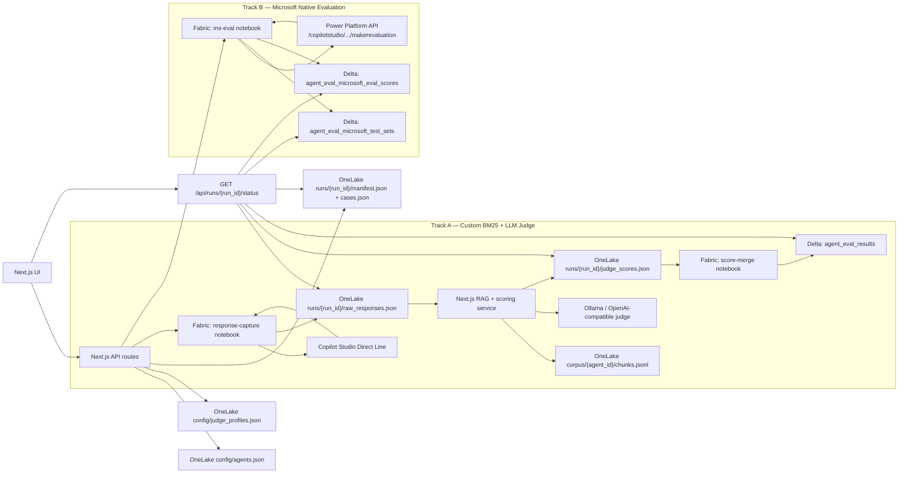

# Next.js Copilot Agent Evaluation App - Staged Implementation Plan

## Summary

Build a standalone Next.js/React web app for end-to-end testing of Copilot Studio agents. The app runs outside Fabric. Fabric Lakehouse/OneLake is used for configuration storage, run artifacts, response captures, judge score files, and the final Delta result tables.

The system runs two parallel, independent evaluation tracks for every run:

**Track A — Custom BM25 + LLM Judge**
The app evaluates uploaded CSV questions against Copilot Studio agent answers. The CSV does not need expected answers. The app retrieves source-of-truth context via BM25 keyword search, asks a configurable judge LLM to create a reference answer and scores, then writes the final result into a single wide Delta table (`agent_eval_results`).

**Track B — Microsoft Native Evaluation (Power Platform API)**
The app triggers Microsoft's built-in Copilot Studio evaluation engine against test sets configured natively inside Copilot Studio. Microsoft runs its own quality metrics (General quality, pass/fail per test case) and returns structured scores, which are written into separate Delta tables (`agent_eval_microsoft_test_sets`, `agent_eval_microsoft_eval_scores`).

Both tracks run in parallel. Neither blocks the other. The run detail page surfaces results from both tracks side by side. Track B is per-agent opt-in; agents without Copilot Studio test sets simply skip it.

For the testing phase, connection values are allowed to be hardcoded into a committed documentation file and mirrored in a server-only config module. This must be treated as temporary; secrets should be rotated before production.

## Architecture



## Stage 0 - Repository And Testing Connection Baseline

Goal: make the repo ready for app implementation and document the temporary testing connections.

Deliverables:

- Create `docs/testing-connections.md` with the testing connection inventory:
  - Fabric workspace ID/name.
  - Lakehouse ID/name.
  - OneLake roots for `Files/agent_eval`, config, runs, and corpus.
  - SQL analytics endpoint connection string for read-only result queries.
  - Fabric service-principal tenant ID, client ID, and client secret.
  - Fabric response-capture notebook ID/name.
  - Fabric score-merge notebook ID/name.
  - Fabric ms-eval notebook ID/name.
  - Power Platform API root and default API version.
  - Copilot agent ID/display name/schema/environment/bot IDs.
  - Direct Line secret for testing.
  - Ollama/OpenAI-compatible judge base URL, model, timeout, temperature.
  - Local dev commands and required ports.
- Add a warning in the doc that committed testing secrets must be rotated before production.
- Add `src/lib/testingConnections.ts` during implementation with the same values in a typed, server-only object.
- Keep every consumer of connection values routed through the server-only config module so migration to environment variables or Key Vault is localized later.

Acceptance criteria:

- A developer can open the repo and identify every external dependency needed for the test environment.
- No browser-facing file imports `testingConnections.ts`.

## Stage 1 - Next.js App Scaffold

Goal: create the standalone web app shell.

Deliverables:

- Scaffold a Next.js TypeScript app in the repo root.
- Use App Router, route handlers, Tailwind, ESLint, and shared TypeScript types.
- Add primary routes:
  - `/` dashboard.
  - `/agents` agent registry.
  - `/judge` judge and RAGAS scoring settings.
  - `/corpus` source-of-truth corpus management.
  - `/runs/new` CSV upload and run creation.
  - `/runs/[run_id]` URL-addressable run status and results.
- Add app-wide layout/navigation optimised for operational use rather than a marketing page.

Acceptance criteria:

- `npm run dev` starts the app.
- `npm run lint` passes.
- Empty UI routes render without requiring Fabric connectivity.

## Stage 2 - Shared Schemas And Data Contracts

Goal: define stable contracts before building APIs.

Deliverables:

- Add schema modules:
  - `src/lib/schemas/agent.ts`
  - `src/lib/schemas/case.ts`
  - `src/lib/schemas/judge.ts`
  - `src/lib/schemas/run.ts`
  - `src/lib/schemas/result.ts`
- CSV required columns:
  - `test_id`
  - `agent_id`
  - `suite`
  - `frequency`
  - `severity`
  - `question`
- CSV optional columns:
  - `category`
  - `source_filter`
  - `must_contain`
  - `must_not_contain`
  - `test_origin`
- Define `source_filter` as an optional text value that restricts retrieval to chunks where `tags`, `document_id`, or `title` match the filter string.
- Define uniqueness as `run_id + agent_id + test_id`.
- Keep `csv_case_index` only for import order/display, not as a key.

Acceptance criteria:

- CSV validation catches missing required fields.
- CSV validation catches duplicate `agent_id + test_id` combinations in a run.
- CSV validation catches unknown agents.
- Test cases do not require expected answers.

## Stage 3 - Fabric And OneLake Infrastructure Layer

Goal: centralise all Fabric and OneLake access behind server-side helpers.

Deliverables:

- `src/lib/fabric/auth.ts`
  - Service-principal token helper.
  - Fabric REST token helper.
  - OneLake/ADLS token helper.
  - Power Platform token helper (scope `https://api.powerplatform.com/.default`).
- `src/lib/fabric/onelake.ts`
  - Read/write JSON.
  - Read/write JSONL.
  - Read/write CSV.
  - ETag/version-aware writes for config files.
  - Safe path builder for `Files/agent_eval`.
- `src/lib/fabric/jobs.ts`
  - Trigger Fabric notebook job.
  - Read Fabric job status.
  - Store returned job IDs in run manifests/results.
- `src/lib/fabric/results.ts`
  - Read `agent_eval_results` from the Lakehouse SQL analytics endpoint.
  - Read `agent_eval_microsoft_eval_scores` from the SQL analytics endpoint.
  - Treat SQL endpoint as read-only.

Acceptance criteria:

- Connectivity endpoint can check Fabric API, OneLake read/write, SQL read, Direct Line, Power Platform API, and judge server independently.
- Failed connectivity checks return actionable error messages.

## Stage 4 - Agent Registry And Judge Configuration

Goal: make agent and judge configuration editable from the UI.

Deliverables:

- Agent registry backed by `Files/agent_eval/config/agents.json`.
- Use ETag/version checks so simultaneous edits do not silently overwrite each other.
- Agent fields:
  - `agent_id`
  - `display_name`
  - `enabled`
  - `platform`
  - `connection_mode`
  - `business_area`
  - `owner`
  - `schema_name`
  - `environment_id`
  - `bot_id`
  - Direct Line secret reference or testing secret value source.
  - `ms_eval_enabled` — whether to trigger Track B for this agent. Default `false`.
  - `ms_eval_test_set_ids` — list of Copilot Studio test set IDs to run. Empty list runs all active sets.
  - `ms_eval_api_version` — Power Platform API version. Default `2024-10-01`.
  - `ms_eval_mcs_connection_id` — optional Direct Line channel override for MS eval.
- Judge settings backed by `Files/agent_eval/config/judge_profiles.json`.
- Judge fields:
  - Provider: `ollama_openai_compatible`, `custom_openai_compatible`, future `azure_openai`.
  - Base URL.
  - Model.
  - API key reference.
  - Temperature.
  - Timeout.
  - Max tokens.
  - Concurrency limit, default `3`.
  - Prompt version.
- RAGAS/scoring settings backed by `Files/agent_eval/config/scoring_profiles.json`.
- Scoring fields:
  - Relevancy threshold.
  - Grounding threshold.
  - Similarity threshold, disabled until embeddings are configured.
  - Prompt template.

Acceptance criteria:

- Agent add/edit/enable/disable works.
- MS eval fields are editable per agent.
- Judge connection test works without creating a run.
- Config saves reject stale versions instead of overwriting.

## Stage 5 - Source-Of-Truth Corpus Management

Goal: support source-grounded scoring without expected answers in the CSV.

V1 retrieval decision:

- Source corpus lives in OneLake under `Files/agent_eval/corpus/{agent_id}/chunks.jsonl`.
- Supported inputs: `.txt`, `.md`, `.csv`, and pasted text.
- PDFs are out of scope for V1 unless added separately.
- Retrieval method is BM25/keyword search in the Next.js server over `chunks.jsonl`.
- Semantic retrieval is a future upgrade requiring embeddings and a vector index.

Chunk shape:

```json
{
  "chunk_id": "sparky-doc-001-0001",
  "agent_id": "sparky",
  "document_id": "doc-001",
  "title": "Product support notes",
  "tags": ["products", "support"],
  "text": "Chunk text...",
  "source_uri": "onelake://...",
  "updated_at": "2026-05-28T00:00:00.000Z"
}
```

Acceptance criteria:

- Users can upload/paste source material for an agent.
- App chunks and writes `chunks.jsonl`.
- Retrieval preview shows top matching chunks for a question and optional `source_filter`.
- Calibration mini-run uses the real retrieval path, not just a raw judge prompt.

## Stage 6 - CSV Upload And Run Creation

Goal: create URL-addressable runs from validated CSVs and kick off both evaluation tracks.

Deliverables:

- CSV upload UI at `/runs/new`.
- Validation preview with row-level errors.
- `POST /api/runs`:
  - Creates a `run_id`.
  - Normalises cases.
  - Writes `runs/{run_id}/manifest.json` — includes a `tracks` field listing which tracks are active for each agent.
  - Writes `runs/{run_id}/cases.json`.
  - Writes agent snapshot.
  - Writes judge/scoring snapshot.
  - Triggers the Fabric response-capture notebook (Track A).
  - If any agent in the run has `ms_eval_enabled: true`, also triggers the Fabric ms-eval notebook (Track B) in parallel.
- `/runs/[run_id]` reconstructs state from OneLake and Delta after refresh or tab close.
- Client polls `GET /api/runs/{run_id}/status` every 5 seconds.
- Status response includes both Track A and Track B job states.
- UI sets expectations that Fabric cold starts can make runs take 5-10 minutes.

Acceptance criteria:

- User can start a run from a question-only CSV.
- Track B notebook is triggered only for agents with `ms_eval_enabled: true`.
- Closing and reopening `/runs/[run_id]` recovers state for both tracks.
- No route handler holds a 30-minute polling loop.

## Stage 7 - Fabric Response Capture Notebook Contract (Track A)

Goal: capture Copilot Studio responses via Direct Line and insert initial Delta rows.

Notebook responsibilities:

- Read `manifest.json` and `cases.json`.
- Call Copilot Studio through Direct Line.
- Write `runs/{run_id}/raw_responses.json`.
- Insert initial rows into `agent_eval_results`.
- Include agent snapshot and deterministic input fields in the initial rows.
- Avoid RAG, judge, or scoring logic.

`raw_responses.json` should be keyed by `test_id`:

```json
{
  "SPARKY_001": {
    "agent_id": "sparky",
    "status": "SUCCESS",
    "agent_response": "Response text...",
    "conversation_id": "conversation-id",
    "latency_ms": 1234,
    "error_type": null
  }
}
```

Acceptance criteria:

- Response capture can be rerun from the same manifest.
- Agent call failures are captured per test case rather than failing the entire run when possible.

## Stage 7b - Fabric MS Eval Notebook Contract (Track B)

Goal: trigger Microsoft's native Copilot Studio evaluation against configured test sets and write results to Delta.

Notebook responsibilities:

- Read `manifest.json` to identify which agents have `ms_eval_enabled: true`.
- For each eligible agent:
  - Acquire a Power Platform token (scope `https://api.powerplatform.com/.default`) using the service principal.
  - Call `GET /environments/{env_id}/bots/{bot_id}/api/makerevaluation/testsets` to discover available test sets.
  - Filter to test sets in `ms_eval_test_set_ids` (or all active sets if the list is empty).
  - Trigger a run for each selected test set: `GET /environments/{env_id}/bots/{bot_id}/api/makerevaluation/testsets/{id}/run`.
  - Poll `GET /environments/{env_id}/bots/{bot_id}/api/makerevaluation/testruns/{run_id}` until completed or timed out (30 minutes max).
  - Flatten per-test-case, per-metric results.
- Write test set metadata to `agent_eval_microsoft_test_sets` Delta table.
- Write per-case scores to `agent_eval_microsoft_eval_scores` Delta table.
- Write `runs/{run_id}/ms_eval_status.json` with job-level state so the Next.js app can surface it.
- Contain no Direct Line, BM25, or LLM judge logic.

`ms_eval_status.json` shape:

```json
{
  "status": "completed",
  "agents": {
    "sparky": {
      "test_sets_discovered": 2,
      "test_sets_run": 2,
      "total_cases": 40,
      "completed_at": "2026-05-28T10:00:00.000Z",
      "error": null
    }
  }
}
```

Power Platform API version used: `2024-10-01` (overridable per agent via `ms_eval_api_version`).

Acceptance criteria:

- MS eval notebook runs independently of Track A with no shared state.
- Timeout per agent is enforced; a timed-out agent does not block others.
- If no test sets are configured in Copilot Studio for an agent, the notebook records `test_sets_discovered: 0` and exits cleanly.
- The notebook is idempotent: rerunning appends a new set of rows keyed by `run_id`.

## Stage 8 - Next.js RAG And Judge Scoring Service (Track A)

Goal: score captured responses with recoverable per-test-case processing.

Deliverables:

- Scoring route reads `raw_responses.json`.
- It loads `chunks.jsonl` for each agent.
- It retrieves top source-of-truth chunks for each question.
- It applies deterministic checks:
  - `must_contain`
  - `must_not_contain`
- It calls the judge server with concurrency limit `3` by default.
- It scores only missing `test_id`s when `judge_scores.json` already exists.
- It writes `runs/{run_id}/judge_scores.json` as an object keyed by `test_id`.

Judge prompt output:

```json
{
  "reference_answer": "Generated only from retrieved context",
  "answer_relevancy_score": 0.0,
  "grounding_score": 0.0,
  "passed": false,
  "reason": "Short explanation",
  "unsupported_claims": []
}
```

Score definitions:

- `answer_relevancy_score`: 0-1 score for whether the Copilot answer addresses the uploaded question.
- `grounding_score`: 0-1 score for whether the Copilot answer is supported by retrieved source-of-truth chunks.
- `similarity_score`: nullable; only populated later when an embedding provider exists.

Acceptance criteria:

- Scoring 50 cases does not run serially by default.
- Crashing after partial scoring resumes only missing cases.
- Invalid judge JSON creates a recoverable per-case error.

## Stage 9 - Lightweight Delta Merge Notebook Contract (Track A)

Goal: merge Track A score files into the single wide custom Delta table.

Notebook responsibilities:

- Read `runs/{run_id}/judge_scores.json`.
- Merge score and verdict fields into `agent_eval_results`.
- Use `run_id + agent_id + test_id` as the merge key.
- Contain no RAG, judge, retrieval, or business logic.

Acceptance criteria:

- If scores exist but Delta rows are missing or stale, rerunning the merge notebook repairs the table.
- Merge is idempotent for the same score file.

## Stage 10 - Final Delta Table Contracts

### Track A — `agent_eval_results`

Merge key: `run_id + agent_id + test_id`.

| Group | Columns |
|---|---|
| Keys | `run_id`, `agent_id`, `test_id` |
| CSV/import | `csv_case_index`, `suite`, `frequency`, `severity`, `category`, `question`, `source_filter`, `test_origin` |
| Agent snapshot | `agent_display_name`, `connection_mode`, `business_area`, `owner`, `schema_name` |
| Run state | `run_status`, `fabric_capture_job_id`, `fabric_merge_job_id`, `created_at`, `started_at`, `completed_at`, `error_message` |
| Copilot response | `agent_response`, `conversation_id`, `latency_ms`, `agent_call_status`, `agent_error_type` |
| RAG reference | `reference_answer`, `reference_context`, `reference_sources`, `reference_context_hash`, `retrieval_status` |
| Judge config | `judge_provider`, `judge_model`, `judge_base_url`, `judge_temperature`, `judge_prompt_version` |
| LLM scores | `answer_relevancy_score`, `grounding_score`, `similarity_score`, `judge_passed`, `judge_reason`, `judge_scored_at` |
| Deterministic checks | `must_contain`, `must_not_contain`, `must_contain_passed`, `must_not_contain_passed`, `deterministic_passed`, `deterministic_reason` |
| Final result | `verdict`, `verdict_reason`, `needs_review` |

Default verdict logic:

- `PASS`: deterministic checks pass and judge scores meet thresholds.
- `FAIL`: agent call fails, deterministic critical check fails, or judge fails.
- `WARN`: retrieval is weak/missing or judge output is invalid but the agent responded.
- `NEEDS_REVIEW`: scoring cannot complete after retry.

### Track B — `agent_eval_microsoft_test_sets`

Append-only. Keyed by `run_id + agent_id + ms_test_set_id`.

| Column | Type | Notes |
|---|---|---|
| `run_id` | string | |
| `agent_id` | string | |
| `environment_id` | string | |
| `bot_id` | string | |
| `ms_test_set_id` | string | Copilot Studio test set GUID |
| `display_name` | string | |
| `state` | string | e.g. Active |
| `total_test_cases` | int | |
| `selected_for_run` | bool | Whether this set was actually triggered |
| `discovered_at` | timestamp | |

### Track B — `agent_eval_microsoft_eval_scores`

Append-only. Keyed by `run_id + agent_id + ms_eval_run_id + ms_test_case_id + metric_type`.

| Column | Type | Notes |
|---|---|---|
| `run_id` | string | |
| `agent_id` | string | |
| `environment_id` | string | |
| `bot_id` | string | |
| `ms_eval_run_id` | string | Microsoft's run GUID |
| `ms_test_set_id` | string | |
| `ms_test_case_id` | string | |
| `metric_type` | string | e.g. "General quality" |
| `metric_label` | string | e.g. "Pass", "Fail" |
| `metric_score` | double | 0.0–1.0 or null |
| `metric_passed` | bool | |
| `status` | string | |
| `reason` | string | Microsoft's AI explanation |
| `scored_at` | timestamp | |

## Stage 11 - Recovery Rules

Recovery is per test case for Track A, and per agent for Track B.

### Track A recovery

`judge_scores.json` format:

```json
{
  "SPARKY_001": {
    "agent_id": "sparky",
    "status": "scored",
    "judge_scored_at": "2026-05-28T00:00:00.000Z",
    "reference_answer": "...",
    "reference_context": "...",
    "reference_sources": ["doc-001#chunk-0001"],
    "reference_context_hash": "...",
    "answer_relevancy_score": 0.86,
    "grounding_score": 0.91,
    "similarity_score": null,
    "must_contain_passed": true,
    "must_not_contain_passed": true,
    "deterministic_passed": true,
    "judge_passed": true,
    "judge_reason": "..."
  }
}
```

Rules:

- Raw responses exist, scores missing: score only missing `test_id`s.
- Scores exist, Delta rows missing: rerun merge notebook.
- Partial `judge_scores.json` exists: continue from unscored cases.
- Capture notebook failed: show the error and allow rerun from the same manifest.

### Track B recovery

Rules:

- MS eval notebook failed mid-run: rerunning the notebook appends a fresh set of rows — Delta tables are append-only so no data is overwritten.
- MS eval timed out for one agent: that agent's status in `ms_eval_status.json` records `error`; other agents are unaffected.
- `ms_eval_status.json` missing: assume Track B is not yet complete; show "pending" in the UI.
- Track A completion does not depend on Track B and vice versa.

## Stage 12 - Run Detail UI

Goal: surface both evaluation tracks on the run detail page.

Deliverables:

- `/runs/[run_id]` page shows:
  - Run metadata (status, created at, agent list).
  - Track A panel: response capture job status, per-case scoring progress, verdict summary table.
  - Track B panel: MS eval job status, test sets discovered, per-agent pass/fail breakdown from Microsoft's metrics. Hidden if no agent in the run has `ms_eval_enabled: true`.
  - A combined summary across both tracks (total cases, pass rate).
- Client polls `GET /api/runs/{run_id}/status` every 5 seconds while either track is still running.
- Status response includes Track A job IDs + Track B job ID + `ms_eval_status.json` content.

Acceptance criteria:

- Track B panel is hidden when no MS-eval-enabled agents are in the run.
- Refreshing the page recovers both Track A and Track B states from OneLake and Delta.
- A run where Track B timed out still shows Track A results correctly.

## Stage 13 - Testing And Manual Acceptance

Unit tests:

- CSV validation.
- Agent registry validation (including MS eval fields).
- ETag conflict handling.
- Corpus chunking and `source_filter`.
- BM25/keyword retrieval.
- Deterministic checks.
- Judge JSON parsing.
- Verdict calculation.
- Per-test-case recovery (Track A).
- Track B status parsing from `ms_eval_status.json`.

Integration tests with mocks:

- OneLake read/write.
- Fabric notebook trigger/status (all three notebooks).
- Direct Line response capture.
- Ollama judge scoring.
- Delta merge payload.
- Power Platform API test set list + run + poll cycle (mocked responses).

Manual acceptance:

- Add an agent with MS eval enabled and test set IDs configured.
- Configure judge server in UI.
- Upload corpus.
- Upload question-only CSV.
- Start a run.
- Confirm Track A runs (Direct Line capture → scoring → merge).
- Confirm Track B runs (MS eval notebook triggers → polls → writes to Delta).
- Refresh `/runs/[run_id]` mid-run — state recovers for both tracks.
- Confirm final `agent_eval_results` has agent snapshot, deterministic checks, RAG reference, judge scores, and verdict.
- Confirm `agent_eval_microsoft_eval_scores` has per-metric rows from Microsoft.
- Simulate partial Track A scoring failure and confirm only missing cases resume.
- Simulate Track B timeout and confirm Track A is unaffected.

## Authentication Approach — Microsoft Entra ID (Company Logins)

The app uses **Microsoft Entra ID user authentication** rather than a service principal. Users sign in with their company Microsoft accounts. All Fabric, OneLake, and Power Platform API calls are made using the signed-in user's own delegated access token. This means:

- No shared service-account credentials to manage or rotate.
- Access is automatically scoped to what each user can already do in the Fabric workspace.
- Users who leave the company lose access automatically.
- Fabric notebooks use `mssparkutils.credentials` internally and are unaffected by app-level auth.

**Implementation:** NextAuth.js with the Microsoft Entra ID provider. The sign-in flow redirects to Microsoft, returns an access token, and stores it in a secure server-side session. All route handlers read the session token and use it for upstream calls. The auth layer in `src/lib/fabric/auth.ts` is updated to read from the NextAuth session instead of doing client-credentials flow.

**Token scopes requested at login:**

| Resource | Scope |
|---|---|
| OneLake / ADLS Gen2 | `https://storage.azure.com/user_impersonation` |
| Fabric REST API | `https://api.fabric.microsoft.com/Item.ReadWrite.All` |
| Power Platform (Track B) | `https://api.powerplatform.com/user_impersonation` |

**IT prerequisites (app registration):** An Azure AD App Registration is required. This is an IT task and can be completed after the app code is built. The app runs in "auth not configured" mode until the registration is in place — all UI routes load and the connectivity checker shows which checks are blocked.

What IT needs to do:
1. Register a new app in Azure Portal → Entra ID → App Registrations.
2. Add redirect URIs: `http://localhost:3000/api/auth/callback/microsoft-entra-id` (dev) + the production URL.
3. Under API permissions, add the three delegated scopes above and grant admin consent.
4. Create a client secret (used only for the auth code exchange, not for data access).
5. Share the **client ID**, **client secret**, and confirm the **tenant ID** (`226e353c-f71a-4b6a-a6af-293275183a60`).

## Assumptions

- Ollama is only the proof-of-concept judge backend for Track A.
- The app runtime is Next.js, not Fabric.
- Fabric Lakehouse/OneLake is the storage layer.
- V1 retrieval is BM25/keyword over OneLake chunk files.
- `similarity_score` is null until embeddings are configured.
- Real secrets may be committed for testing only and must be rotated before production.
- Track B requires test sets to already exist in Copilot Studio. The app does not create or manage Copilot Studio test sets.
- All three resource token scopes are acquired via the same Microsoft Entra ID login session.
- The app gracefully degrades when the app registration is not yet configured — UI loads, connectivity checks report `not_configured`.

## Credentials And Prerequisites Tracker

| Item | Stage needed | Status | Notes |
|---|---|---|---|
| Entra ID app registration client ID | Stage 3+ auth | Pending IT | Azure Portal → App Registrations |
| Entra ID app registration client secret | Stage 3+ auth | Pending IT | Certificates & secrets tab |
| Tenant ID | Stage 3+ auth | Known | `226e353c-f71a-4b6a-a6af-293275183a60` |
| Admin consent granted for 3 API scopes | Stage 3+ auth | Pending IT | One-click in API permissions tab |
| Production redirect URI | Pre-deploy | Pending | Add once hosting URL is known |
| SQL endpoint server | Stage 10 | Known | `hq2w4iq265vexjvpfezhkgb2ma-aqj6lwmkfnre5nujsixht7lwwq.datawarehouse.fabric.microsoft.com` |
| SQL endpoint database | Stage 10 | Known | `jacks_Lakehouse` |
| Response-capture notebook item ID | Stage 7 | Pending | Create blank notebook in Fabric workspace, copy item ID |
| Score-merge notebook item ID | Stage 9 | Pending | Create blank notebook in Fabric workspace, copy item ID |
| MS eval notebook item ID | Stage 7b | Pending | Create blank notebook in Fabric workspace, copy item ID |
| Copilot Studio test set IDs for Sparky | Stage 7b | Pending | Copilot Studio → Sparky → Test → Test sets |
| `ms_eval_mcs_connection_id` | Stage 7b | Optional | Only if routing via a specific Direct Line channel |
